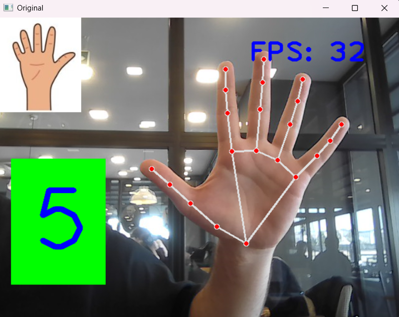
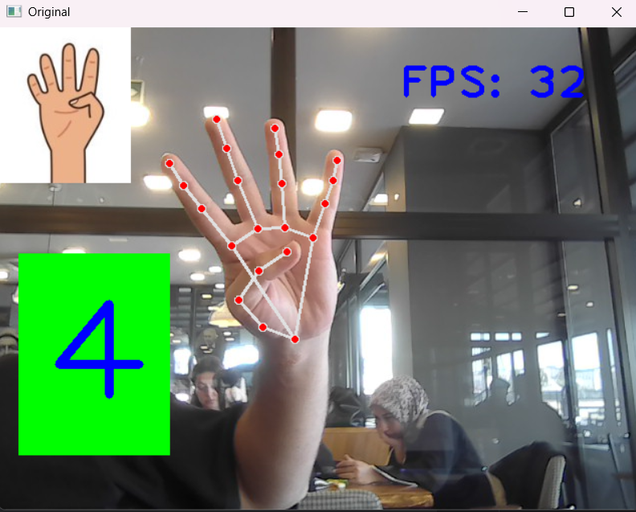
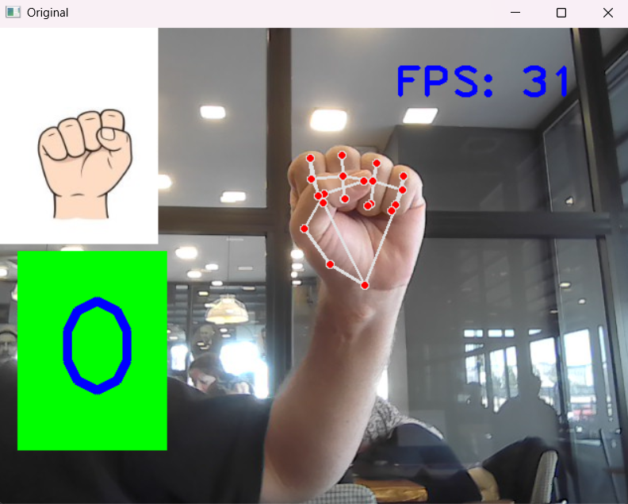

# 🖐️ Gerçek Zamanlı Parmak Sayma Uygulaması (Real-Time Finger Counter)

Bu proje, Python ve MediaPipe kütüphanelerini kullanarak bir web kamerası akışı üzerinde el algılama yapar ve açık parmak sayısını **gerçek zamanlı** olarak belirler. Tespit edilen parmak sayısına karşılık gelen özel bir görseli ekranın sol üst köşesine yerleştirir.

## ✨ Temel Özellikler

* **Gerçek Zamanlı İşlem:** Canlı kamera akışında anlık olarak parmak sayımı.
* **MediaPipe Algoritması:** Güçlü ve doğru el iskeleti (landmarks) tespiti.
* **Görsel Geri Bildirim:** Açık parmak sayısına uygun hazırlanan görselleri ekranın sol üst köşesine yerleştirme.
* **FPS Gösterimi:** Uygulamanın performansını gösteren Kare Hızı (FPS) sayacı.

## ⚠️ Önemli Not: Sol El Duyarlılığı

Kod içerisinde parmakların açık/kapalı durumunu kontrol eden mantık, parmak uçlarının eklem noktalarına göre **dikey (Y ekseni)** ve **yatay (X ekseni)** konumlarını karşılaştırır.

**Bu mantık, özellikle Başparmak kontrolü, ekran karşısında tutulan sol ele (el avuç içi kameraya bakarken) uygun şekilde yapılandırılmıştır.** Sağ elinizi kullanırken hatalı sonuçlar alabilirsiniz.

## 🖼️ Çıktı Örnekleri ve Görsel Geri Bildirim
  
  
  

## ⚙️ Gereksinimler

Projeyi çalıştırmak için gerekli temel kütüphaneler:

```bash
pip install opencv-python mediapipe

